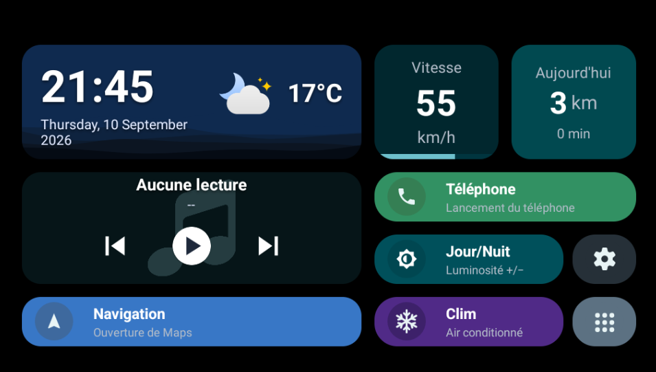
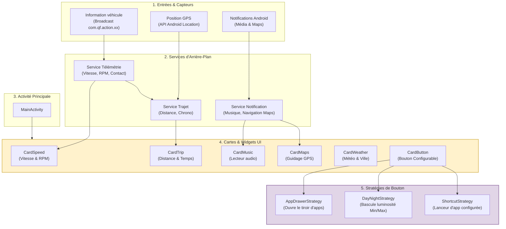

# CarLauncher



## Architecture


Ce schéma résume le fonctionnement global du Car Launcher, structuré en couches indépendantes pour garantir modularité et réactivité.

En amont, les **services d'arrière-plan** interceptent les événements système et réseau (trame CANbus du véhicule, coordonnées GPS, notifications) pour les traiter en tâche de fond. Les **cartes UI** s'abonnent directement à ces services et mettent à jour leurs affichages de manière autonome (vitesse, trajet, lecteur multimédia, navigation et météo).

L'interactivité repose sur le **Design Pattern Strategy** : la carte bouton (`CardButton`) délègue son comportement à la stratégie configurée (`AppDrawerStrategy`, `DayNightStrategy` ou `ShortcutStrategy`). Cela permet d'ajouter ou de modifier des fonctionnalités de boutons sans toucher au code de l'interface graphique.

## Extraction Matérielle (`hardware_dump`)

Le dossier `hardware_dump`, situé à la racine du projet, contient les fichiers systèmes et les applications d'origine extraits directement de l'autoradio physique.

Ces fichiers servent de base de référence pour le *reverse-engineering* du système d'usine (MCU QF01) :

**Configurations et informations système :**
* `build.prop` et `syste_properties.txt` : Contiennent la configuration matérielle, les limites de l'OS et confirment la véritable version d'Android.
* `display_info.txt` : Détaille les caractéristiques de l'écran (résolution réelle, DPI, gestion de l'affichage).
* `package_list.txt` : Liste complète des applications et services installés sur l'appareil.
* `su_check.txt` : Rapport d'informations sur l'état du root (super user)

**Applications et frameworks (pour décompilation) :**
* `framework.apk` : Le cœur du système Android modifié par le constructeur. Utile pour analyser les comportements non standards (comme les restrictions du gestionnaire de fenêtres).
* `com.qf.vehicule.apk` : Gère la communication directe avec le boîtier CANbus (permet de retrouver les actions pour la vitesse, le régime moteur, le contact).
* `com.qf.carsettings.apk` : Application des paramètres natifs du véhicule.
* `com.qf.commonfunc.apk` : Regroupe les fonctions communes et les services en arrière-plan du constructeur (gestion des commandes au volant, radio, etc.).

> **Note :** Il est recommandé de décompiler ces APK (via un outil comme *Jadx*) pour retrouver les noms exacts des `Intents` et des `Broadcasts` cachés, indispensables pour intégrer la télémétrie dans le Launcher.

## Compilation (Release)

Pour que le système de mise à jour automatique via GitHub (Self-Update) fonctionne sur l'autoradio, chaque nouvelle version doit obligatoirement être signée avec la même clé cryptographique que la version initiale installée en `priv-app`.

> **Note sur la sécurité :** Bien que ce dépôt soit public, le fichier de signature (keystore) est délibérément inclus dans le code source. C'est un choix assumé : ce projet est strictement personnel, destiné à une utilisation privée, et ne sera jamais publié sur le Play Store. Cette approche simplifie considérablement la compilation locale et l'automatisation via GitHub Actions.

### Informations de la clé

| Propriété | Valeur |
|---|---|
| **Emplacement du fichier** | `/release_key` |
| **Mot de passe (Store)** | `CarLauncher` |
| **Mot de passe (Clé/Alias)** | `key0` |

### Compiler la Release depuis Android Studio

La configuration de la signature étant déjà codée en dur dans le fichier `build.gradle`, Android Studio gère la signature de manière totalement transparente.

1. Dans le menu principal, cliquer sur **Build > Generate Signed App Bundle(s) or APK(s)**.
2. Sélectionner **APK**.
3. Choisir la clé pour la signature de l'application.
4. Choisir **Release** puis cliquer sur le bouton **Create**.
5. L'application prête à être déployée sera générée ici : `app/build/outputs/apk/release/app-release.apk`.

### Déploiement Automatisé (GitHub Actions)

Ce projet utilise GitHub Actions pour compiler, signer et publier (création de release) automatiquement l'application à chaque nouvelle version. L'APK généré est ensuite mis à disposition de l'autoradio qui le téléchargera via son système de mise à jour interne.

Le script est configuré pour se déclencher automatiquement lorsqu'un tag est poussé sur le dépôt.

> **Note :** Ajouter un commentaire au push du tag pour l'intégrer automatiquement au changelog de la release.

## Installation

L'installation de cette application ne se fait pas de manière classique. Elle doit obligatoirement être installée en tant qu'**Application Système Privilégiée** (`priv-app`).

### priv-app

Placer l'application dans le dossier `/system/priv-app/` de l'autoradio est indispensable pour trois raisons majeures :

1. **Lecture des données de la voiture (Télémétrie) :**
   Pour recevoir la vitesse, le régime moteur (RPM) et les signaux de contact (ACC ON/OFF), l'application doit s'abonner aux flux du boîtier CANbus. Cela nécessite de modifier des paramètres restreints d'Android (`Settings.Global`) via la permission critique `WRITE_SECURE_SETTINGS`. Une application `priv-app` obtient cette permission automatiquement sans blocage de sécurité.
2. **Immunité contre la fermeture (Task Killer) :**
   Les autoradios Android possèdent une gestion de l'énergie très agressive qui "tue" les applications en arrière-plan. En tant que `priv-app`, notre service de chronomètre devient intouchable. Il tournera toujours en tâche de fond pour garantir la sauvegarde des données au moment précis de l'extinction du moteur.
3. **Mises à jour (Self-Update) :**
   Ce statut octroie la permission `INSTALL_PACKAGES`, permettant à l'application de télécharger ses propres mises à jour depuis GitHub et de les installer en arrière-plan, sans aucune intervention de l'utilisateur à l'écran.

### Permissions système

Le fichier `privapp-permissions-carlauncher.xml` présent à la racine du projet permet de valider les permissions privilégiées (comme `WRITE_SECURE_SETTINGS` ou `INSTALL_PACKAGES`) lorsque l'application est exécutée en tant qu'application système dans `/system/priv-app/`.

Sous Android 10 (API 29), ce fichier est obligatoire pour éviter que le système ne bloque l'application au démarrage.

* **Usage :** Déclarer les privilèges accordés à l'application.
* **Déploiement :** Ce fichier est automatiquement poussé vers `/system/etc/permissions/` lors de l'installation via le script `install.bat`.

### Émulateur

#### Configuration de l'émulateur (AVD)

Pour développer et tester l'application sur PC dans des conditions stables :

* **Écran :** 9" — 1024 × 600 (120 dpi)
* **Version Android :** API 33 (Android 13)
* **Image système :** Google APIs Intel x86_64 (ou arm64) System Image

> **Note sur le système et l'émulateur :** Bien que l'autoradio physique soit vendu sous la mention « Android 13 », l'extraction de ses propriétés système (`build.prop`) confirme qu'il s'agit en réalité d'un **Android 10 (API 29)** maquillé par le constructeur. Cependant, les images système d'Android 10 sur émulateur présentant trop d'instabilités matérielles et de bugs bloquants (notamment des crashs de mémoire avec Google Maps), l'environnement de développement sur PC est configuré sous **Android 13 (API 33)** pour garantir un confort de travail optimal.
#### Déverrouillage de l'émulateur

Pour tester l'application dans les mêmes conditions (en tant que `priv-app`) sur PC, il faut injecter l'APK directement dans le système de l'émulateur Android Studio.

**Procédure étape par étape :**

1. **Lancer l'émulateur en mode écriture :**

Ouvrir un terminal et démarrer l'émulateur avec le flag `writable-system` (remplacer `Nom_Emulateur` par le nom configuré) :

```bash
emulator -avd Nom_Emulateur -writable-system
```

2. **Déverrouiller le système (ADB) :**

Dans un autre terminal, désactiver les sécurités de vérification et redémarrer :

```bash
adb root
adb disable verity
adb reboot
```

3. **Monter le système en écriture :**

Une fois l'émulateur redémarré sur l'écran d'accueil, taper :

```bash
adb root
adb remount
```
_(Le terminal doit afficher `remount succeeded`)_

### Autoradio (Appareil physique)

Pour installer l'application sur la voiture, l'utilisation d'ADB via Wi-Fi est requise. Le PC et l'autoradio doivent impérativement être connectés au **même réseau Wi-Fi**.

*Astuce : La méthode la plus simple et la plus fiable consiste à activer le partage de connexion (hotspot Wi-Fi) d'un smartphone, puis d'y connecter à la fois le PC et l'autoradio.*

**Sur l'autoradio, le débogage Wi-Fi est en root par défaut.**

**Procédure de connexion et d'installation :**

1. **Récupérer l'adresse IP de l'autoradio :**
- Sur le téléphone, aller dans les paramètres du **Partage de connexion** (Hotspot Wi-Fi).
- Chercher la section **Appareils connectés** (ou *Gérer les appareils*).
- Repérer l'autoradio dans la liste pour y trouver l'adresse IP attribuée (ex : `192.168.43.50`).

2. **Se connecter via ADB (Port 9876) :**
- L'autoradio utilise le port spécifique `9876` pour le débogage réseau.
- Sur le PC, ouvrir un terminal et taper la commande suivante en remplaçant par la bonne IP :
    ```bash
    adb connect 192.168.43.50:9876
    ```
- Le terminal doit répondre `connected to 192.168.43.50:9876`.
  *(Si une fenêtre d'autorisation de débogage apparaît sur l'écran de l'autoradio, cocher « Toujours autoriser cet ordinateur » et valider).*

### Installeur (`install.bat`)

Pour lancer l'installation, exécuter le script `install.bat`.
Le script va :
- Transférer l'APK dans la partition système (`/system/priv-app/`)
- Copier le fichier des permissions `privapp-permissions-carlauncher.xml` dans `/system/etc/permissions/`
- Redémarrer la machine automatiquement pour appliquer les droits.

### Vérification de l'installation

Une fois l'appareil redémarré, il est important de vérifier qu'Android a bien reconnu l'application avec ses privilèges système.

Pour s'assurer que l'installation en `priv-app` a fonctionné :

1. Sur l'autoradio (ou l'émulateur), aller dans les **Paramètres Android**.
2. Ouvrir le menu **Applications** (ou *Toutes les applications*).
3. Chercher et sélectionner l'application **CarLauncher**.
4. Observer le bouton **Désinstaller** :
- S'il est **grisé, absent, ou remplacé par "Désactiver"** : L'installation a réussi, l'application fait désormais partie intégrante du système d'usine.
- S'il est cliquable normalement (et permet de supprimer l'application) : L'installation a échoué, l'application est installée de manière classique. Vérifier les logs du script `install.bat` pour identifier le blocage lors de la copie.

## Simulation et Tests ADB (Télémétrie & Veille)

Il est possible de simuler les signaux du véhicule (CANbus/MCU QF01) via **ADB** afin de tester le fonctionnement du `CarTelemetryService` et du `TripService` sur émulateur sans être raccordé au véhicule.

* **Activer le contact (ACC ON) :**

```bash
adb shell am broadcast -a com.qf.action.ACC_ON
```

* **Désactiver le contact (ACC OFF) :**

```bash
adb shell am broadcast -a com.qf.action.ACC_OFF
```

* **Simuler la vitesse et le régime moteur (ex : 60 km/h, 2200 RPM) :**

```bash
adb shell am broadcast -a com.qf.vehicle.action.DATA_SHARE --ei speed 60 --ei rpm 2200
```