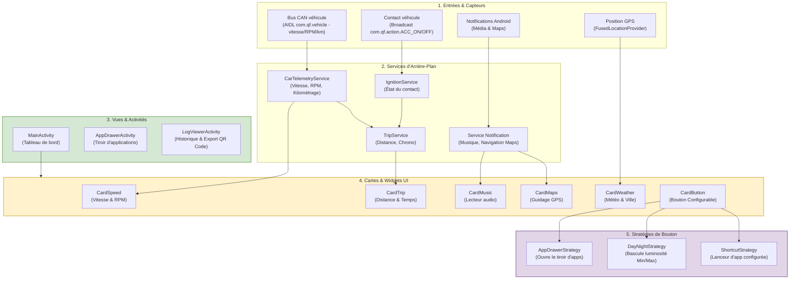

# CarLauncher


## Fonctionnalités Principales
- **Tableau de bord dynamique :** L'interface est construite autour d'un système de "cartes" autonomes s'actualisant en temps réel. Elles regroupent toutes les informations essentielles à la conduite : vitesse et régime moteur (RPM), temps et distance du trajet, météo locale, guidage GPS en cours, et lecteur multimédia.

- **Reprise automatique de la musique (Autoplay) :** Au démarrage du véhicule, le launcher force automatiquement la reprise de la lecture en arrière-plan sur le lecteur multimédia défini par l'utilisateur dans les paramètres (Spotify, YouTube Music, etc.), sans nécessiter la moindre action manuelle.

- **Gestion intelligente des trajets (Smart Reset) :** Le système surveille les actions de contact du véhicule (allumage et coupure du moteur) et le kilométrage total remonté par le bus CAN pour enregistrer de manière autonome les sessions de conduite. Un algorithme de Smart Reset se charge de réinitialiser intelligemment les statistiques journalières (kilomètres parcourus, temps de conduite) entre deux trajets éloignés dans le temps.

- **Diagnostic et Exportation des logs par QR Code :** Une vue dédiée (LogViewerActivity) permet de consulter les journaux de l'application. Pour éviter la saturation de la mémoire, un système de rotation ne conserve que les événements récents. Ces logs peuvent être exportés vers un serveur pour diagnostic : l'application génère alors un QR Code à l'écran permettant de récupérer instantanément les données sur un smartphone.

## Architecture


Ce schéma résume le fonctionnement global du Car Launcher, structuré en couches indépendantes pour garantir modularité et réactivité.

En amont, les **services d'arrière-plan** interceptent les événements système et réseau (contact et bus CAN du véhicule, coordonnées GPS, notifications) pour les traiter en tâche de fond. Les **cartes UI** s'abonnent directement à ces services et mettent à jour leurs affichages de manière autonome (vitesse, trajet, lecteur multimédia, navigation et météo).

L'interactivité repose sur le **Design Pattern Strategy** : la carte bouton (`CardButton`) délègue son comportement à la stratégie configurée (`AppDrawerStrategy`, `DayNightStrategy` ou `ShortcutStrategy`). Cela permet d'ajouter ou de modifier des fonctionnalités de boutons sans toucher au code de l'interface graphique.

`IgnitionService` et `CarTelemetryService` sont volontairement deux services distincts (et non un seul "service CAN") : l'état du contact (ACC ON/OFF) et la télémétrie du bus CAN utilisent deux mécanismes de transport radicalement différents côté autoradio (broadcast système vs interface AIDL) — voir la section suivante. `TripService` s'abonne aux deux pour calculer la distance et le temps de conduite.

## Télémétrie CAN bus (AIDL)

L'autoradio embarque une application système (`com.qf.vehicle`, package du constructeur "QF", cf. `hardware_dump/com.qf.vehicule.apk`) qui communique avec le boîtier CANbus. Elle expose un service AIDL, `ICanBusServiceFeature` (action `com.qf.vehicle.service.ACTION_CAN_SERVICE`, exporté sans permission particulière), que `CarTelemetryService` utilise pour recevoir en temps réel la vitesse, le régime moteur et le kilométrage total — sans limite de fréquence, au rythme réel du bus CAN.

Les événements de contact (`com.qf.action.ACC_ON` / `com.qf.action.ACC_OFF`) sont de simples broadcasts système, indépendants de ce service AIDL, gérés séparément par `IgnitionService`.

### Fonctionnement du client AIDL (`CarTelemetryService`)

`CarTelemetryService` implémente un **client AIDL minimal fait main**, en `Parcel`/`IBinder.transact()` brut, sans fichier `.aidl` généré ni classe copiée depuis `com.qf.vehicle`. Seules les 2 transactions réellement nécessaires sont reproduites, avec les codes exacts identifiés par rétro-ingénierie (décompilation JADX) du `Stub` du SDK constructeur :

| Étape | Détail |
|---|---|
| **Bind** | `bindService` explicite sur l'action `com.qf.vehicle.service.ACTION_CAN_SERVICE`, package `com.qf.vehicle`. Aucune permission requise (service exporté sans `android:permission`). |
| **Init SDK** (code transaction `1`) | Envoie `demandType=0` (mode "App"), nom `"QFApp"` et une clé codée en dur (`832ded976b28e7ee81a688a4f4095331`) — couple attendu par le SDK constructeur pour activer la distribution des trames. |
| **Abonnement** (code `11`) | Enregistre un callback (`Binder` maison implémentant `onTransact`) qui recevra chaque trame décodée sans throttle. |
| **Réception** (code `2`, `onGetPackedData`) | Le callback reçoit un `byte[]` : en-tête `0x98`, type de trame (`2` = CarbodyState), puis vitesse (offset 8, 2 octets), RPM (offset 10, 2 octets) et kilométrage total (offset 16, 3 octets, en dixièmes de km). |

## Simuler le bus CAN sans la vraie tête d'unité (module `fake-vehicle`)

Le protocole AIDL ci-dessus ne peut pas être simulé par un simple `adb shell am broadcast` : contrairement à un broadcast, c'est un `bindService()` vers un package précis (`com.qf.vehicle`), absent d'un émulateur générique. Pour tester `CarTelemetryService` sans la vraie tablette, le projet inclut un second module Gradle, **`fake-vehicle`**, qui usurpe ce package et reproduit le strict minimum du protocole côté serveur.

> ⚠️ **Ce module usurpe le package `com.qf.vehicle`.** À installer **uniquement sur émulateur ou appareil de test** — jamais sur la vraie tablette, où il entrerait en conflit avec l'application système du même nom.

### Installer et lancer le stub

Le module possède sa propre `MainActivity` (simple écran de statut, sans dépendance AppCompat) : il se lance donc comme une app normale depuis Android Studio.

* **Depuis Android Studio :** sélectionner la configuration de run `fake-vehicle`, puis ▶️ (Run) ou 🐞 (Debug) comme n'importe quelle app.

Le service (`VehicleServiceStub`) démarre automatiquement dès que `CarTelemetryService` (côté CarLauncher) s'y connecte — inutile de le lancer manuellement au préalable. L'écran de statut affiche en direct si CarLauncher est connecté, si le SDK est initialisé, et les dernières valeurs vitesse/RPM/km reçues.

### Simuler le contact (ACC ON / OFF)

Ce sont de simples broadcasts système, indépendants du stub :

```bash
adb shell am broadcast -a com.qf.action.ACC_ON
adb shell am broadcast -a com.qf.action.ACC_OFF
```

### Simuler la vitesse, le RPM et le kilométrage

Le stub pousse une trame CarbodyState **à la demande**, via un broadcast de contrôle qui lui est propre (`com.qf.vehicle.debug.SET_CARBODY_STATE`) :

```bash
adb shell am broadcast -a com.qf.vehicle.debug.SET_CARBODY_STATE \
    --ei speed 87 --ei rpm 2300 --ef mileage 217005.1
```

Chaque extra (`speed`, `rpm`, `mileage`) est optionnel : une valeur non précisée conserve sa dernière valeur connue (changer uniquement la vitesse ne réinitialise donc pas le RPM ou le kilométrage). Le stub pousse aussi automatiquement l'état courant dès que `CarTelemetryService` s'enregistre, sans attendre une première commande.

## Extraction Matérielle (`hardware_dump`)

Le dossier `hardware_dump`, situé à la racine du projet, contient les fichiers systèmes et les applications d'origine extraits directement de l'autoradio physique.

Ces fichiers servent de base de référence pour le *reverse-engineering* du système d'usine (MCU QF01) :

**Configurations et informations système :**
* `build.prop` et `syste_properties.txt` : Contiennent la configuration matérielle, les limites de l'OS et confirment la véritable version d'Android.
* `display_info.txt` : Détaille les caractéristiques de l'écran (résolution réelle, DPI, gestion de l'affichage).
* `package_list.txt` : Liste complète des applications et services installés sur l'appareil.
* `su_check.txt` : Rapport d'informations sur l'état du root (super user)

**Applications et frameworks (pour décompilation) :**
* `framework.apk` : Le cœur du système Android modifié par le constructeur. Utile pour analyser les comportements non standards (comme les restrictions du gestionnaire de fenêtres).
* `com.qf.vehicule.apk` : Gère la communication directe avec le boîtier CANbus (permet de retrouver les actions pour la vitesse, le régime moteur, le contact, ainsi que le service AIDL `ICanBusServiceFeature` — voir la section "Télémétrie CAN bus" ci-dessus).
* `com.qf.carsettings.apk` : Application des paramètres natifs du véhicule.
* `com.qf.commonfunc.apk` : Regroupe les fonctions communes et les services en arrière-plan du constructeur (gestion des commandes au volant, radio, etc.).

> **Note :** Il est recommandé de décompiler ces APK (via un outil comme *Jadx*) pour retrouver les noms exacts des `Intents`, des `Broadcasts` et des interfaces AIDL cachées, indispensables pour intégrer la télémétrie dans le Launcher.

## Compilation (Release)

Pour que le système de mise à jour automatique via GitHub (Self-Update) fonctionne sur l'autoradio, chaque nouvelle version doit obligatoirement être signée avec la même clé cryptographique que la version initiale installée en `priv-app`.

> **Note sur la sécurité :** Bien que ce dépôt soit public, le fichier de signature (keystore) est délibérément inclus dans le code source. C'est un choix assumé : ce projet est strictement personnel, destiné à une utilisation privée, et ne sera jamais publié sur le Play Store. Cette approche simplifie considérablement la compilation locale et l'automatisation via GitHub Actions.

### Informations de la clé

| Propriété | Valeur |
|---|---|
| **Emplacement du fichier** | `/release_key` |
| **Mot de passe (Store)** | `CarLauncher` |
| **Mot de passe (Clé/Alias)** | `key0` |

### Compiler la Release depuis Android Studio

La configuration de la signature étant déjà codée en dur dans le fichier `build.gradle`, Android Studio gère la signature de manière totalement transparente.

1. Dans le menu principal, cliquer sur **Build > Generate Signed App Bundle(s) or APK(s)**.
2. Sélectionner **APK**.
3. Choisir la clé pour la signature de l'application.
4. Choisir **Release** puis cliquer sur le bouton **Create**.
5. L'application prête à être déployée sera générée ici : `app/build/outputs/apk/release/app-release.apk`.

> **Note :** Ces étapes concernent uniquement le module `app` (CarLauncher). Le module `fake-vehicle` est un outil de développement/test, jamais signé ni publié en release.

### Déploiement Automatisé (GitHub Actions)

Ce projet utilise GitHub Actions pour compiler, signer et publier (création de release) automatiquement l'application à chaque nouvelle version. L'APK généré est ensuite mis à disposition de l'autoradio qui le téléchargera via son système de mise à jour interne.

Le script est configuré pour se déclencher automatiquement lorsqu'un tag est poussé sur le dépôt.

> **Note :** Ajouter un commentaire au push du tag pour l'intégrer automatiquement au changelog de la release.

## Installation

L'installation de cette application ne se fait pas de manière classique. Elle doit obligatoirement être installée en tant qu'**Application Système Privilégiée** (`priv-app`).

### priv-app

Placer l'application dans le dossier `/system/priv-app/` de l'autoradio est indispensable pour deux raisons majeures :

1. **Immunité contre la fermeture (Task Killer) :**
   Les autoradios Android possèdent une gestion de l'énergie très agressive qui "tue" les applications en arrière-plan. En tant que `priv-app`, nos services (`IgnitionService`, `CarTelemetryService`, `TripService`) deviennent intouchables. Ils tournent toujours en tâche de fond pour garantir la sauvegarde des données au moment précis de l'extinction du moteur.
2. **Mises à jour (Self-Update) :**
   Ce statut octroie la permission `INSTALL_PACKAGES`, permettant à l'application de télécharger ses propres mises à jour depuis GitHub et de les installer en arrière-plan, sans aucune intervention de l'utilisateur à l'écran.

> **Note :** La télémétrie (voir "Télémétrie CAN bus" ci-dessus) ne nécessite aucune permission particulière — le service `com.qf.vehicle` s'y bind sans permission requise. `WRITE_SECURE_SETTINGS` reste déclarée dans le manifest mais n'est plus strictement nécessaire pour cette fonctionnalité.

### Permissions système

Le fichier `privapp-permissions-carlauncher.xml` présent à la racine du projet permet de valider les permissions privilégiées (comme `WRITE_SECURE_SETTINGS` ou `INSTALL_PACKAGES`) lorsque l'application est exécutée en tant qu'application système dans `/system/priv-app/`.

Sous Android 10 (API 29), ce fichier est obligatoire pour éviter que le système ne bloque l'application au démarrage.

* **Usage :** Déclarer les privilèges accordés à l'application.
* **Déploiement :** Ce fichier est automatiquement poussé vers `/system/etc/permissions/` lors de l'installation via le script `install.bat`.

### Émulateur

#### Configuration de l'émulateur (AVD)

Pour développer et tester l'application sur PC dans des conditions stables :

* **Écran :** 9" — 1024 × 600 (120 dpi)
* **Version Android :** API 33 (Android 13)
* **Image système :** Google APIs Intel x86_64 (ou arm64) System Image

> **Note sur le système et l'émulateur :** Bien que l'autoradio physique soit vendu sous la mention « Android 13 », l'extraction de ses propriétés système (`build.prop`) confirme qu'il s'agit en réalité d'un **Android 10 (API 29)** maquillé par le constructeur. Cependant, les images système d'Android 10 sur émulateur présentant trop d'instabilités matérielles et de bugs bloquants (notamment des crashs de mémoire avec Google Maps), l'environnement de développement sur PC est configuré sous **Android 13 (API 33)** pour garantir un confort de travail optimal.
#### Déverrouillage de l'émulateur

Pour tester l'application dans les mêmes conditions (en tant que `priv-app`) sur PC, il faut injecter l'APK directement dans le système de l'émulateur Android Studio.

**Procédure étape par étape :**

1. **Lancer l'émulateur en mode écriture :**

Ouvrir un terminal et démarrer l'émulateur avec le flag `writable-system` (remplacer `Nom_Emulateur` par le nom configuré) :

```bash
emulator -avd Nom_Emulateur -writable-system
```

2. **Déverrouiller le système (ADB) :**

Dans un autre terminal, désactiver les sécurités de vérification et redémarrer :

```bash
adb root
adb disable verity
adb reboot
```

3. **Monter le système en écriture :**

Une fois l'émulateur redémarré sur l'écran d'accueil, taper :

```bash
adb root
adb remount
```
_(Le terminal doit afficher `remount succeeded`)_

### Autoradio (Appareil physique)

Pour installer l'application sur la voiture, l'utilisation d'ADB via Wi-Fi est requise. Le PC et l'autoradio doivent impérativement être connectés au **même réseau Wi-Fi**.

*Astuce : La méthode la plus simple et la plus fiable consiste à activer le partage de connexion (hotspot Wi-Fi) d'un smartphone, puis d'y connecter à la fois le PC et l'autoradio.*

**Sur l'autoradio, le débogage Wi-Fi est en root par défaut.**

**Procédure de connexion et d'installation :**

1. **Récupérer l'adresse IP de l'autoradio :**
- Sur le téléphone, aller dans les paramètres du **Partage de connexion** (Hotspot Wi-Fi).
- Chercher la section **Appareils connectés** (ou *Gérer les appareils*).
- Repérer l'autoradio dans la liste pour y trouver l'adresse IP attribuée (ex : `192.168.43.50`).

2. **Se connecter via ADB (Port 9876) :**
- L'autoradio utilise le port spécifique `9876` pour le débogage réseau.
- Sur le PC, ouvrir un terminal et taper la commande suivante en remplaçant par la bonne IP :
    ```bash
    adb connect 192.168.43.50:9876
    ```
- Le terminal doit répondre `connected to 192.168.43.50:9876`.
  *(Si une fenêtre d'autorisation de débogage apparaît sur l'écran de l'autoradio, cocher « Toujours autoriser cet ordinateur » et valider).*

### Installeur (`install.bat`)

Pour lancer l'installation, exécuter le script `install.bat`.
Le script va :
- Transférer l'APK dans la partition système (`/system/priv-app/`)
- Copier le fichier des permissions `privapp-permissions-carlauncher.xml` dans `/system/etc/permissions/`
- Redémarrer la machine automatiquement pour appliquer les droits.

### Vérification de l'installation

Une fois l'appareil redémarré, il est important de vérifier qu'Android a bien reconnu l'application avec ses privilèges système.

Pour s'assurer que l'installation en `priv-app` a fonctionné :

1. Sur l'autoradio (ou l'émulateur), aller dans les **Paramètres Android**.
2. Ouvrir le menu **Applications** (ou *Toutes les applications*).
3. Chercher et sélectionner l'application **CarLauncher**.
4. Observer le bouton **Désinstaller** :
- S'il est **grisé, absent, ou remplacé par "Désactiver"** : L'installation a réussi, l'application fait désormais partie intégrante du système d'usine.
- S'il est cliquable normalement (et permet de supprimer l'application) : L'installation a échoué, l'application est installée de manière classique. Vérifier les logs du script `install.bat` pour identifier le blocage lors de la copie.
