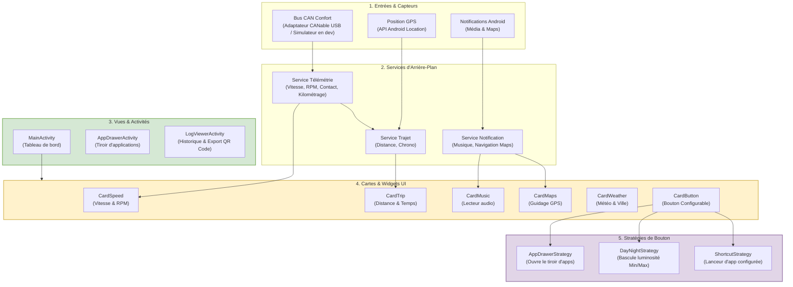

# CarLauncher


## Fonctionnalités Principales
- **Tableau de bord dynamique :** L'interface est construite autour d'un système de "cartes" autonomes s'actualisant en temps réel. Elles regroupent toutes les informations essentielles à la conduite : vitesse et régime moteur (RPM), temps et distance du trajet, météo locale, guidage GPS en cours, et lecteur multimédia.

- **Reprise automatique de la musique (Autoplay) :** Au démarrage du véhicule, le launcher force automatiquement la reprise de la lecture en arrière-plan sur le lecteur multimédia défini par l'utilisateur dans les paramètres (Spotify, YouTube Music, etc.), sans nécessiter la moindre action manuelle.

- **Gestion intelligente des trajets (Smart Reset) :** Le système surveille les actions de contact du véhicule (allumage et coupure du moteur) pour enregistrer de manière autonome les sessions de conduite. Un algorithme de Smart Reset se charge de réinitialiser intelligemment les statistiques journalières (kilomètres parcourus, temps de conduite) entre deux trajets éloignés dans le temps.

- **Diagnostic et Exportation des logs par QR Code :** Une vue dédiée (LogViewerActivity) permet de consulter les journaux de l'application. Pour éviter la saturation de la mémoire, un système de rotation ne conserve que les événements récents. Ces logs peuvent être exportés vers un serveur pour diagnostic : l'application génère alors un QR Code à l'écran permettant de récupérer instantanément les données sur un smartphone.

## Architecture


Ce schéma résume le fonctionnement global du Car Launcher, structuré en couches indépendantes pour garantir modularité et réactivité.

En amont, les **services d'arrière-plan** interceptent les événements système et réseau (trame CANbus du véhicule, coordonnées GPS, notifications) pour les traiter en tâche de fond. Les **cartes UI** s'abonnent directement à ces services et mettent à jour leurs affichages de manière autonome (vitesse, trajet, lecteur multimédia, navigation et météo).

L'interactivité repose sur le **Design Pattern Strategy** : la carte bouton (`CardButton`) délègue son comportement à la stratégie configurée (`AppDrawerStrategy`, `DayNightStrategy` ou `ShortcutStrategy`). Cela permet d'ajouter ou de modifier des fonctionnalités de boutons sans toucher au code de l'interface graphique.

## Extraction Matérielle (`hardware_dump`)

Le dossier `hardware_dump`, situé à la racine du projet, contient les fichiers systèmes et les applications d'origine extraits directement de l'autoradio physique.

Ces fichiers servent de base de référence pour le *reverse-engineering* du système d'usine (MCU QF01) :

**Configurations et informations système :**
* `build.prop` et `syste_properties.txt` : Contiennent la configuration matérielle, les limites de l'OS et confirment la véritable version d'Android.
* `display_info.txt` : Détaille les caractéristiques de l'écran (résolution réelle, DPI, gestion de l'affichage).
* `package_list.txt` : Liste complète des applications et services installés sur l'appareil.
* `su_check.txt` : Rapport d'informations sur l'état du root (super user)

**Applications et frameworks (pour décompilation) :**
* `framework.apk` : Le cœur du système Android modifié par le constructeur. Utile pour analyser les comportements non standards (comme les restrictions du gestionnaire de fenêtres).
* `com.qf.vehicule.apk` : Gère la communication du constructeur avec le boîtier CANbus. La télémétrie du Launcher ne dépend plus de cet APK (voir [Télémétrie (Bus CAN)](#télémétrie-bus-can) : lecture directe du bus via un adaptateur CANable) ; il reste une référence utile pour identifier d'autres trames/IDs du bus Confort.
* `com.qf.carsettings.apk` : Application des paramètres natifs du véhicule.
* `com.qf.commonfunc.apk` : Regroupe les fonctions communes et les services en arrière-plan du constructeur (gestion des commandes au volant, radio, etc.).

> **Note :** Il est recommandé de décompiler ces APK (via un outil comme *Jadx*) pour retrouver les noms exacts des `Intents` et des `Broadcasts` cachés (notifications média/navigation, commandes au volant...).

## Base de données

L'application persiste certaines données (statistiques de trajet, dernière position connue) sur une base **PostgreSQL** hébergée chez **[Neon](https://neon.tech)** (serverless, autoscale à zéro).

### Connexion

La connexion se fait en **JDBC direct** (`org.postgresql:postgresql`) plutôt que via l'API REST/HTTP de Neon (Data API) : le projet ne compte que deux tables, la surcharge d'une couche REST ne se justifiait pas (étant donné la complexité de l'authentification).

* `NeonClient` (`repository/client/NeonClient.java`) ouvre et réutilise une connexion JDBC globale (`DriverManager.getConnection(...)`), rouverte automatiquement si elle est fermée, invalide, ou après un échec.
* Les repositories (`CarLocationRepository`, `TripDailyRepository`, ...) n'exécutent jamais de requête directement : ils empilent leur SQL via `WorkerManager.addQueue(...)`.
* `WorkerManager` (au-dessus de **WorkManager**) transforme chaque requête en file persistante FIFO (stockée en base Room par WorkManager), contrainte à une connexion réseau disponible (`NetworkType.CONNECTED`), avec retry automatique (backoff linéaire) en cas d'échec. Elle survit donc au kill du process ou à un redémarrage de l'appareil tant qu'une requête n'a pas été exécutée avec succès.

### Fournisseur (Neon) : branches

Le projet Neon possède deux branches, avec les mêmes identifiants (user/password) :

| Branche | Usage |
|---|---|
| `production` | Base utilisée en usage réel sur l'autoradio |
| `dev` | Base utilisée pour le développement local / émulateur |

Le choix de la branche utilisée ne dépend **pas** de qui compile l'application (Android Studio vs pipeline GitHub) mais du device sur lequel elle tourne — voir [Environnements Dev / Prod](#environnements-dev--prod) ci-dessous.

### `local.properties` et secrets

Les identifiants de connexion (URLs JDBC, user, password) ainsi que les mots de passe de signature de l'APK **ne sont jamais commités** : ils sont lus depuis `local.properties` (fichier local, listé dans `.gitignore`) par `app/build.gradle.kts`, puis exposés au code Java via des champs générés (`BuildConfig.DEV_DB_URL`, `BuildConfig.PROD_DB_URL`, `BuildConfig.DB_USER`, `BuildConfig.DB_PASSWORD`).

En l'absence de `local.properties` (typiquement en CI/GitHub Actions), le script retombe automatiquement sur des **variables d'environnement** de même nom (`secret(key)` cherche d'abord `local.properties`, puis `System.getenv(key)`) — dans ce cas les valeurs viennent des **secrets du dépôt GitHub**.

Clés attendues dans `local.properties` :

```properties
# Connexion base de données (Neon / PostgreSQL) — les deux URLs sont toujours embarquées,
# le user/password est le même pour les deux branches (voir section Environnements Dev / Prod)
DEV_DB_URL=jdbc:postgresql://<host-neon-dev>:5432/car_launcher
PROD_DB_URL=jdbc:postgresql://<host-neon-prod>:5432/car_launcher
DB_USER=<utilisateur>
DB_PASSWORD=<mot_de_passe>

# Signature de l'APK (voir section Compilation ci-dessous)
SIGNING_STORE_PASSWORD=<mot_de_passe_store>
SIGNING_KEY_PASSWORD=<mot_de_passe_cle>
```

> **Sécurité :** ce fichier contient des secrets réels en local (identifiants Neon notamment) et ne doit **jamais** être ajouté au dépôt Git. Il est déjà exclu via `.gitignore` (`local.properties`) ; en cas de doute, vérifier avec `git status` avant tout commit/push.

### Environnements Dev / Prod

Le launcher se met à jour lui-même en téléchargeant la dernière release GitHub (Self-Update, voir [Déploiement Automatisé](#déploiement-automatisé-github-actions)) : **un seul et même APK** circule donc, que ce soit sur l'autoradio réel ou sur un device de test. Séparer dev/prod via deux artefacts de build différents aurait empêché de tester ce mécanisme de mise à jour sans risquer d'installer/exécuter la configuration prod ailleurs que sur la voiture.

À la place, le choix de la branche Neon utilisée se fait **à l'exécution, en fonction du device**, et non du build :

* `BuildConfig` embarque toujours les deux URLs (`DEV_DB_URL` et `PROD_DB_URL`).
* `DeviceEnvironment.isProd()` (`utils/DeviceEnvironment.java`) vérifie la présence d'un fichier marqueur : `/system/etc/carlauncher_prod`.
* Ce marqueur n'est déposé **que** par `install.bat`, lors du flash en `priv-app`, et seulement après confirmation explicite dans le script ("Est-ce que ce device est le VRAI device de PRODUCTION ?"). Étant dans `/system`, il survit aux mises à jour de l'application (y compris via le Self-Update).
* `NeonClient` choisit `BuildConfig.PROD_DB_URL` ou `BuildConfig.DEV_DB_URL` selon `DeviceEnvironment.isProd()`.
* Sur tout device non marqué prod, un badge rouge **"DEV"** s'affiche en bas de l'écran d'accueil pour visualiser immédiatement l'environnement actif.

Conséquence pratique : installer/tester l'APK (y compris la release GitHub officielle) sur un émulateur ou un device de test ne touchera **jamais** la base de production, sauf à avoir explicitement répondu "oui" à la question de `install.bat` sur ce device.

## Préférences locales (SharedPreferences)

En complément de la base Neon, l'application conserve certaines données uniquement sur le device (raccourcis assignés aux boutons, dernière position météo en cache, compteurs de trajet...) via les **SharedPreferences** standard d'Android, toutes regroupées dans un seul fichier (`CarLauncherPrefs`).

### `PerfsKey` : centralisation des clés

Toutes les clés utilisées à travers l'application sont centralisées dans `utils/PerfsKey.java`, regroupées par classe imbriquée correspondant à leur classe d'origine (`PerfsKey.TripStats`, `PerfsKey.TripService`, `PerfsKey.ShortcutStrategy`, `PerfsKey.CardWeather`...). Chaque classe imbriquée préfixe ses propres clés (ex: `trip_stats_`, `card_weather_`) pour éviter toute collision au sein du fichier partagé.

### `PerfsKeyMigration` : faire évoluer une clé sans perte de données

Renommer une clé ou changer le type de son contenu ne doit **jamais** nécessiter de vider les préférences existantes ni d'inventer une nouvelle clé arbitraire à la volée. `utils/PerfsKeyMigration.java` fournit un système de migration versionné, inspiré des migrations de base de données :

* `PerfsKey.MIGRATIONS` déclare un tableau ordonné d'étapes ; l'index d'une étape correspond à la version de schéma qu'elle fait atteindre.
* Helpers disponibles pour construire une étape : `renameKey(oldKey, newKey)`, `changeType(key, fromType, toType)` (conversion automatique entre `Integer`, `Long`, `Float`, `Boolean`, `String`), `removeKey(key)`, et `clear(prefsFileName)` (suppression complète d'un fichier de préférences, y compris un fichier legacy qui n'est plus utilisé).
* `PerfsKeyMigration.migrate(context)` est appelé une seule fois, tout au début de `CarLauncherApp.onCreate()` (avant tout accès aux préférences par un composant de l'app). Chaque étape manquante est rejouée et **committée individuellement** : un crash en cours de route ne rejoue pas une migration déjà appliquée.
* Pour ajouter une migration : ajouter une nouvelle entrée à la fin de `MIGRATIONS`, ne jamais modifier ni supprimer une entrée déjà publiée.

## Compilation (Release)

Pour que le système de mise à jour automatique via GitHub (Self-Update) fonctionne sur l'autoradio, chaque nouvelle version doit obligatoirement être signée avec la même clé cryptographique que la version initiale installée en `priv-app`.

> **Note sur la sécurité :** Bien que ce dépôt soit public, le fichier de signature (keystore) est délibérément inclus dans le code source. C'est un choix assumé : ce projet est strictement personnel, destiné à une utilisation privée, et ne sera jamais publié sur le Play Store. Cette approche simplifie considérablement la compilation locale et l'automatisation via GitHub Actions.

### Informations de la clé

| Propriété | Valeur |
|---|---|
| **Emplacement du fichier** | `/release_key` |
| **Mot de passe (Store)** | `CarLauncher` |
| **Mot de passe (Clé/Alias)** | `key0` |

### Compiler la Release depuis Android Studio

La configuration de la signature étant déjà codée en dur dans le fichier `build.gradle`, Android Studio gère la signature de manière totalement transparente.

1. Dans le menu principal, cliquer sur **Build > Generate Signed App Bundle(s) or APK(s)**.
2. Sélectionner **APK**.
3. Choisir la clé pour la signature de l'application.
4. Choisir **Release** puis cliquer sur le bouton **Create**.
5. L'application prête à être déployée sera générée ici : `app/build/outputs/apk/release/app-release.apk`.

### Déploiement Automatisé (GitHub Actions)

Ce projet utilise GitHub Actions pour compiler, signer et publier (création de release) automatiquement l'application à chaque nouvelle version. L'APK généré est ensuite mis à disposition de l'autoradio qui le téléchargera via son système de mise à jour interne.

Le script est configuré pour se déclencher automatiquement lorsqu'un tag est poussé sur le dépôt.

> **Note :** Ajouter un commentaire au push du tag pour l'intégrer automatiquement au changelog de la release.

## Installation

L'installation de cette application ne se fait pas de manière classique. Elle doit obligatoirement être installée en tant qu'**Application Système Privilégiée** (`priv-app`).

### priv-app

Placer l'application dans le dossier `/system/priv-app/` de l'autoradio est indispensable pour deux raisons majeures :

1. **Immunité contre la fermeture (Task Killer) :**
   Les autoradios Android possèdent une gestion de l'énergie très agressive qui "tue" les applications en arrière-plan. En tant que `priv-app`, nos services (télémétrie, chronomètre de trajet...) deviennent intouchables. Ils tournent toujours en tâche de fond, y compris pour garantir la sauvegarde des données au moment précis de l'extinction du moteur.
2. **Mises à jour (Self-Update) :**
   Ce statut octroie la permission `INSTALL_PACKAGES`, permettant à l'application de télécharger ses propres mises à jour depuis GitHub et de les installer en arrière-plan, sans aucune intervention de l'utilisateur à l'écran.

### Permissions système

Le fichier `privapp-permissions-carlauncher.xml` présent à la racine du projet permet de valider les permissions privilégiées (comme `WRITE_SECURE_SETTINGS` ou `INSTALL_PACKAGES`) lorsque l'application est exécutée en tant qu'application système dans `/system/priv-app/`.

Sous Android 10 (API 29), ce fichier est obligatoire pour éviter que le système ne bloque l'application au démarrage.

* **Usage :** Déclarer les privilèges accordés à l'application.
* **Déploiement :** Ce fichier est automatiquement poussé vers `/system/etc/permissions/` lors de l'installation via le script `install.bat`.

### Émulateur

#### Configuration de l'émulateur (AVD)

Pour développer et tester l'application sur PC dans des conditions stables :

* **Écran :** 9" — 1024 × 600 (120 dpi)
* **Version Android :** API 33 (Android 13)
* **Image système :** Google APIs Intel x86_64 (ou arm64) System Image

> **Note sur le système et l'émulateur :** Bien que l'autoradio physique soit vendu sous la mention « Android 13 », l'extraction de ses propriétés système (`build.prop`) confirme qu'il s'agit en réalité d'un **Android 10 (API 29)** maquillé par le constructeur. Cependant, les images système d'Android 10 sur émulateur présentant trop d'instabilités matérielles et de bugs bloquants (notamment des crashs de mémoire avec Google Maps), l'environnement de développement sur PC est configuré sous **Android 13 (API 33)** pour garantir un confort de travail optimal.
#### Déverrouillage de l'émulateur

Pour tester l'application dans les mêmes conditions (en tant que `priv-app`) sur PC, il faut injecter l'APK directement dans le système de l'émulateur Android Studio.

**Procédure étape par étape :**

1. **Lancer l'émulateur en mode écriture :**

Ouvrir un terminal et démarrer l'émulateur avec le flag `writable-system` (remplacer `Nom_Emulateur` par le nom configuré) :

```bash
emulator -avd Nom_Emulateur -writable-system
```

2. **Déverrouiller le système (ADB) :**

Dans un autre terminal, désactiver les sécurités de vérification et redémarrer :

```bash
adb root
adb disable verity
adb reboot
```

3. **Monter le système en écriture :**

Une fois l'émulateur redémarré sur l'écran d'accueil, taper :

```bash
adb root
adb remount
```
_(Le terminal doit afficher `remount succeeded`)_

### Autoradio (Appareil physique)

Pour installer l'application sur la voiture, l'utilisation d'ADB via Wi-Fi est requise. Le PC et l'autoradio doivent impérativement être connectés au **même réseau Wi-Fi**.

*Astuce : La méthode la plus simple et la plus fiable consiste à activer le partage de connexion (hotspot Wi-Fi) d'un smartphone, puis d'y connecter à la fois le PC et l'autoradio.*

**Sur l'autoradio, le débogage Wi-Fi est en root par défaut.**

**Procédure de connexion et d'installation :**

1. **Récupérer l'adresse IP de l'autoradio :**
- Sur le téléphone, aller dans les paramètres du **Partage de connexion** (Hotspot Wi-Fi).
- Chercher la section **Appareils connectés** (ou *Gérer les appareils*).
- Repérer l'autoradio dans la liste pour y trouver l'adresse IP attribuée (ex : `192.168.43.50`).

2. **Se connecter via ADB (Port 9876) :**
- L'autoradio utilise le port spécifique `9876` pour le débogage réseau.
- Sur le PC, ouvrir un terminal et taper la commande suivante en remplaçant par la bonne IP :
    ```bash
    adb connect 192.168.43.50:9876
    ```
- Le terminal doit répondre `connected to 192.168.43.50:9876`.
  *(Si une fenêtre d'autorisation de débogage apparaît sur l'écran de l'autoradio, cocher « Toujours autoriser cet ordinateur » et valider).*

### Installeur (`install.bat`)

Pour lancer l'installation, exécuter le script `install.bat`.
Le script va :
- Transférer l'APK dans la partition système (`/system/priv-app/`)
- Copier le fichier des permissions `privapp-permissions-carlauncher.xml` dans `/system/etc/permissions/`
- Redémarrer la machine automatiquement pour appliquer les droits.

### Vérification de l'installation

Une fois l'appareil redémarré, il est important de vérifier qu'Android a bien reconnu l'application avec ses privilèges système.

Pour s'assurer que l'installation en `priv-app` a fonctionné :

1. Sur l'autoradio (ou l'émulateur), aller dans les **Paramètres Android**.
2. Ouvrir le menu **Applications** (ou *Toutes les applications*).
3. Chercher et sélectionner l'application **CarLauncher**.
4. Observer le bouton **Désinstaller** :
- S'il est **grisé, absent, ou remplacé par "Désactiver"** : L'installation a réussi, l'application fait désormais partie intégrante du système d'usine.
- S'il est cliquable normalement (et permet de supprimer l'application) : L'installation a échoué, l'application est installée de manière classique. Vérifier les logs du script `install.bat` pour identifier le blocage lors de la copie.

## Télémétrie (Bus CAN)

La télémétrie (vitesse, régime moteur, contact, kilométrage) est lue directement sur le bus CAN **Confort** (125 kbps) du véhicule, exposée par `TelemetryService` (`service/telemetry/`) sous forme de `Property<T>` observables regroupées dans `VehicleData` :

```java
VehicleData data = telemetryService.getData();
data.rpm.bind(this::onRpmChanged);
data.speed.bind(this::onSpeedChanged);
```

### Architecture

* `CanBus` résout, au démarrage, les décodeurs de trames (`Frame`) disponibles pour le véhicule ciblé (`FrameResolver`, registre statique indexé par `Vehicle`), puis démarre un `CanReader`.
* Chaque `Frame` (ex: `Frame0B6`, `Frame0F6` pour la Peugeot 407) décode les octets d'une trame CAN précise et met à jour `VehicleData` — un seul point de vérité, partagé par toute l'app.
* `CanReader` a deux implémentations, choisies par `TelemetryService` selon `DeviceEnvironment.isProd()` :
  * **`CanableReader`** (production) : lit un adaptateur [CANable](https://canable.io) branché en USB via `usb-serial-for-android` (protocole SLCAN, écoute seule/Listen-Only à 125 kbps). Gère la demande de permission USB ainsi que la reconnexion automatique (branchement/débranchement détectés en temps réel, nouvel essai après une erreur de lecture).
  * **`ReaderSimulatorPeugeot407`** (dev/test — actif par défaut sur tout device non marqué prod) : génère de fausses trames CAN 0B6/0F6, avec le même encodage que les trames réelles, et les fait décoder par les vrais `Frame` : toute la chaîne est exercée sans adaptateur ni véhicule branché. Le kilométrage simulé, lui, est persisté (SharedPreferences) comme un vrai odomètre — il ne repart jamais de zéro entre deux lancements de l'app.

### Simulation et tests ADB

Tant qu'aucune routine n'est déclenchée, le simulateur reste inerte (contact coupé, régime et vitesse à zéro — l'odomètre, lui, garde sa dernière valeur persistée). Il est entièrement piloté par broadcast, pour tester sans recompiler l'app :

* **Démarrer un trajet type** (ralenti → accélération → croisière → décélération → ralenti, avec la chute de régime caractéristique à chaque changement de rapport simulé) :

```bash
adb shell am broadcast -a com.rguilbeau.carlauncher.debug.simulator.START_ROUTINE_1 --ef cruise_speed_kmh 130 --ez loop true
```
*(les deux extras sont optionnels : `cruise_speed_kmh` défaut 110, `loop` défaut true — l'odomètre continue depuis sa valeur courante, voir `SET_ODOMETER` ci-dessous pour le repositionner)*

* **Arrêter le trajet en cours :**

```bash
adb shell am broadcast -a com.rguilbeau.carlauncher.debug.simulator.STOP_ROUTINE
```

* **Forcer une valeur précise** (écrasée au tick suivant si un trajet est actif) :

```bash
adb shell am broadcast -a com.rguilbeau.carlauncher.debug.simulator.SET_RPM --ei value 3000
adb shell am broadcast -a com.rguilbeau.carlauncher.debug.simulator.SET_SPEED --ef value 90
adb shell am broadcast -a com.rguilbeau.carlauncher.debug.simulator.SET_CONTACT_ON --ez value true
adb shell am broadcast -a com.rguilbeau.carlauncher.debug.simulator.SET_ODOMETER --el value 87450
```

> **Note :** ce canal de contrôle n'existe que lorsque `ReaderSimulatorPeugeot407` est instancié (jamais en production, voir `DeviceEnvironment.isProd()` ci-dessus) — son receiver est donc volontairement exporté (atteignable par `adb`), sans risque hors d'un device de dev/test.